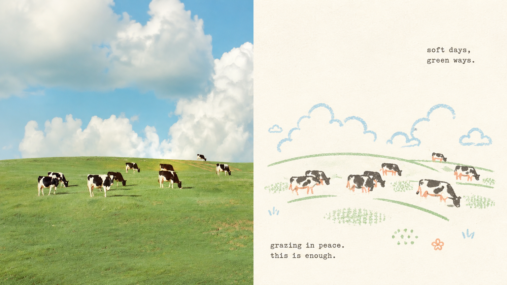
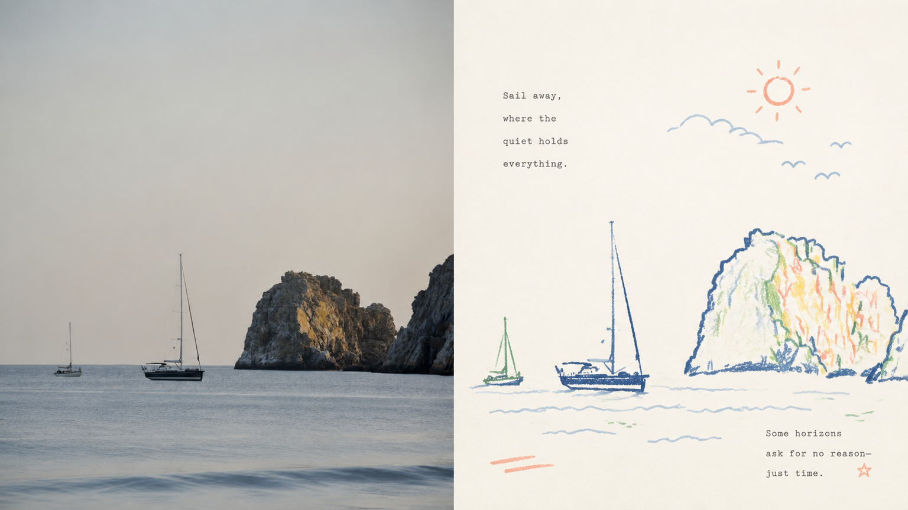
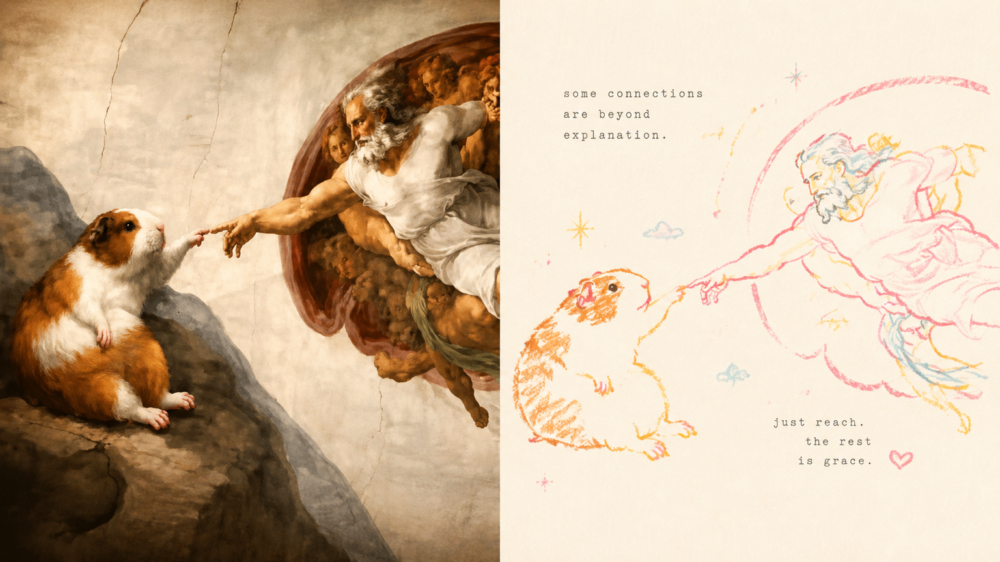
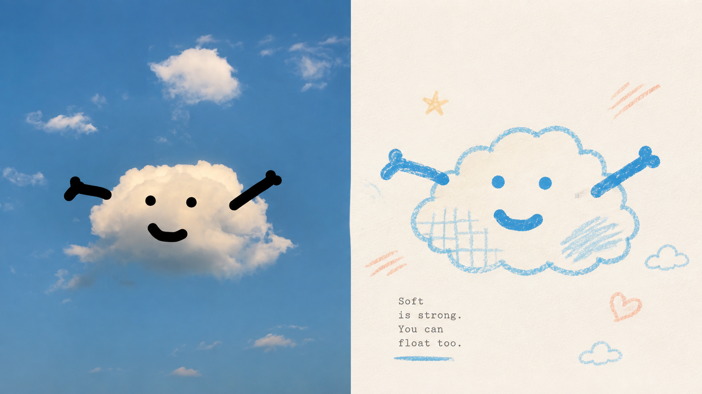
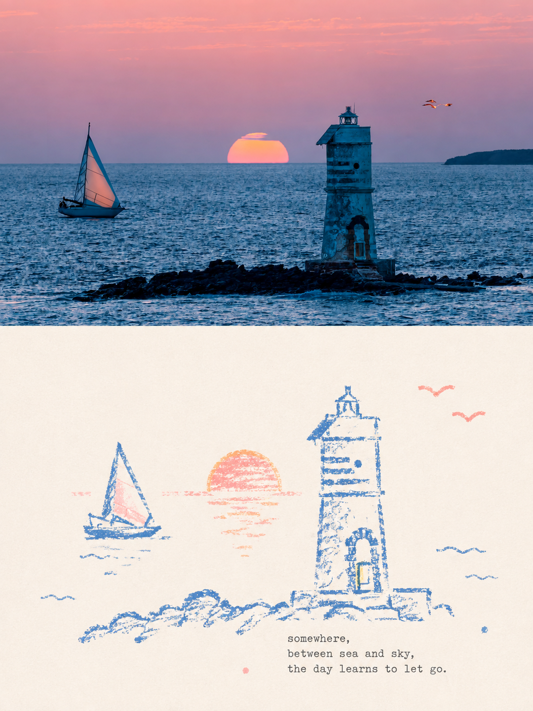
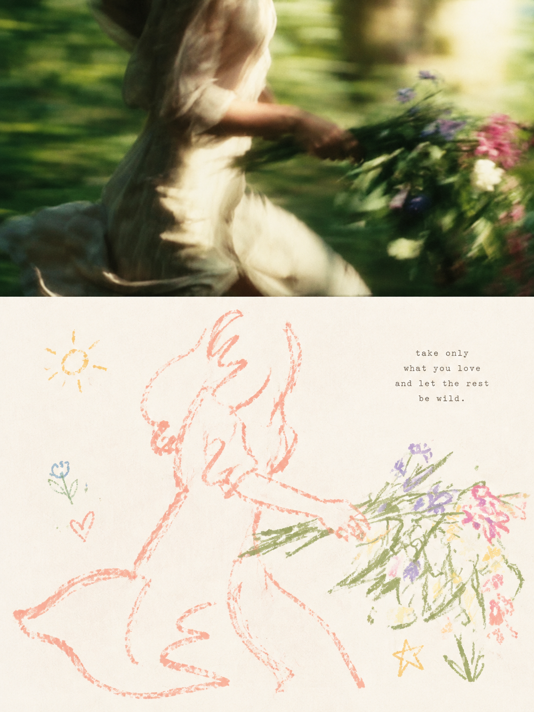
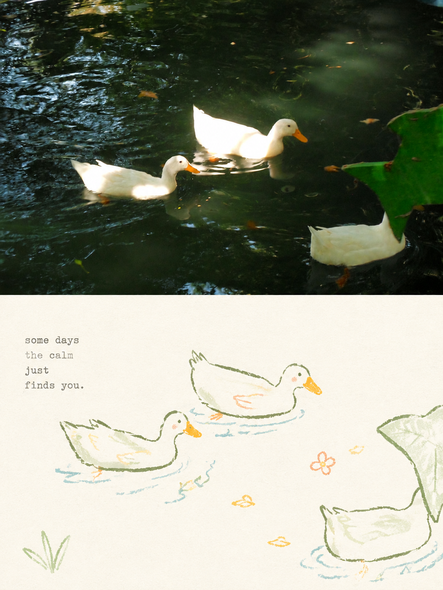
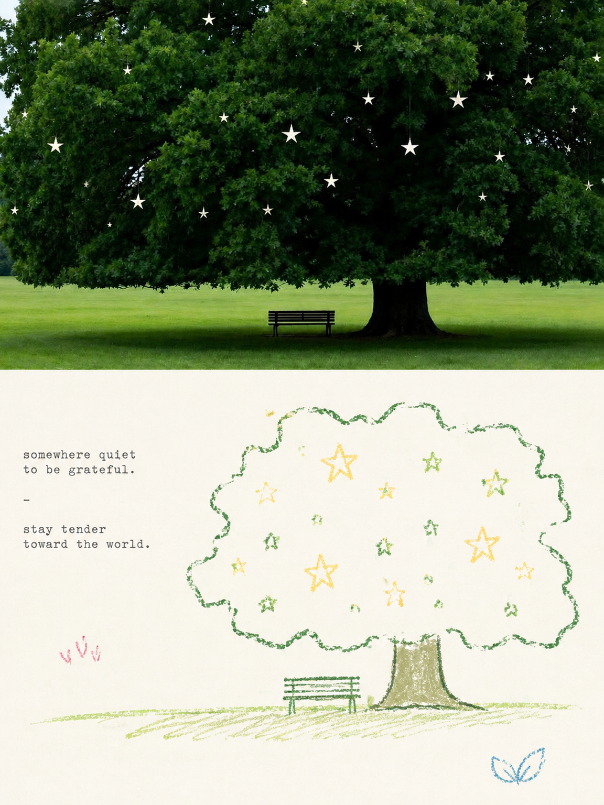

<div align="center">

# XXD Panel 116｜浅纸粉彩涂鸦志

让照片留下清楚的轮廓、轻松的色彩和一块会呼吸的纸面

<strong>简体中文</strong> · <a href="README.en.md">English</a> · <a href="README.ja.md">日本語</a> · <a href="README.ko.md">한국어</a> · <a href="README.ar.md">العربية</a>

</div>

## 样张展示

以下样张均来自不同的原始参考图，由 Panel 116 独立单轮生成，并已清理 AI 元数据。横版严格为左侧原图、右侧设计，各占 50%；竖版严格为上方原图、下方设计，各占 50%。

**16:9 横版 · 左右 50:50**

| sample-05 | sample-06 |
|---|---|
|  |  |
|  |  |

**3:4 竖版 · 上下 50:50**

| sample-09 | sample-10 |
|---|---|
|  |  |
|  |  |

## 适用场景与解决的问题

有些照片真正动人的不是信息量，而是一个主体、一段姿态、几种颜色和照片留下的情绪。**Panel 116** 保留上半部分的真实照片，再把下半部分转译成极浅纸面上的粉彩蜡笔涂鸦：粗颗粒轮廓、少量柔和色块、极简符号和小尺度主体共同留出呼吸感。

### 适合这些情况

- 想保留照片的身份与自然质感，同时得到更轻松、更像艺术出版物的海报。
- 不想逐物描摹、写实转绘或把背景塞满，只想留下核心主题、关系和视觉记忆点。
- 喜欢明亮治愈的粉彩色，但不接受灰暗、低对比、荧光或廉价糖果感。
- 需要同一套风格稳定输出上下、左右、纯设计、多比例、四端壁纸或目录批处理。

### 它替你解决什么

- 把复杂照片中的次要信息删掉，避免主体被细节和装饰吞没。
- 用清晰彩线与浅纸底保持识别度，避免背景和主体糊在一起。
- 让对照构图严格只有两个 50:50 区域，不出现标题带、底栏或第三分区。
- 每张图从当前原图一次直达生成，不把样张、中间结果或其他 Panel 作品再次送入模型。

## 原始提示词 · 五种语言

[简体中文](references/original-prompt/zh-CN.md) · [English](references/original-prompt/en.md) · [日本語](references/original-prompt/ja.md) · [한국어](references/original-prompt/ko.md) · [العربية](references/original-prompt/ar.md)

中文文件逐字保存用户提供的原始提示词，是运行时唯一的创作与审美权威。其他四个版本是完整、忠实的阅读译文，不会反向改写生图指令。

**关键词：** 极浅纸面 · 粗颗粒粉彩蜡笔轮廓 · 极简涂鸦符号 · 小尺度主体 · 2–4 色照片取色 · 清晰彩线 · 大量艺术留白 · 旧式机械印字

## 快速判断：Panel 116 适合你吗？

| 你关心的问题 | 这套风格给你的回答 |
|---|---|
| 想要照片与设计之间有清楚的关系？ | 上方保留真实照片，下方以同一主体的涂鸦转译回应它。 |
| 担心抽象后认不出原物？ | 优先保留核心主题、主体关系、轮廓走势、姿态和色彩记忆。 |
| 喜欢粉彩但不想画面发灰？ | 采用极浅背景、清晰彩线和少量柔和色块，保持足够对比。 |
| 需要多种交付尺寸？ | 支持常用比例、准确像素、四种模式和目录批量。 |

## 它如何把照片变成成品

```text
理解主题与主体关系 → 提炼轮廓、姿态、方向和情绪 → 删除次要细节 → 用粗颗粒蜡笔线与少量粉彩色块重构 → 放入极浅纸面和稀疏涂鸦符号 → 以留白与克制的机械印字完成海报
```

## 成品中最容易识别的特点

- 设计区使用极浅、明亮、干净的近白纸色，背景明度明显高于主体线条与色块。
- 主体轮廓粗、松弛、干涩，带粉末颗粒、断续掉色、轻微抖动和不完全闭合边缘。
- 周围符号只用一笔或几笔表达，不做精致图标、贴纸或独立小插画。
- 主体保持小尺度、偏心或局部裁切，大面积留白主动参与构图。
- 从原图提取 2–4 种鲜活而亲和的颜色，形成明亮柔和的粉彩蜡笔色板。
- 文字只作少量编辑性介入，采用疏朗、轻微不齐的旧式机械印字；不使用固定标题模板。

## 四种输出模式

- `top-bottom`：整张画布只有上下两个全宽区域，现实照片在上、设计在下，严格各占 50%。
- `left-right`：整张画布只有左右两个全高区域，现实照片在左、设计在右，严格各占 50%，不会旋转成上下结构。
- `design-only`：整张画布只呈现 Panel 116 的设计转译，照片只作为不可见参考。
- `wallpaper-pack`：按手机、iPad、桌面和手表分别生成完整设计壁纸，可选 `linked` 连贯套装或 `independent` 四张独立。

支持多选模式与比例（`1:1`、`3:4`、`4:3`、`4:5`、`5:4`、`2:3`、`3:2`、`9:16`、`16:9`、`21:9`、`5:7`、`7:5` 或准确像素），以及模型生成文字、准确文字和无文字。传入目录会递归扫描图片，每张源图独立处理，共用一次交付设置；最终 PNG 平铺放入一个新任务目录。

## 开始使用

```bash
git clone https://github.com/nevertoday/xxd-panel-116.git
npx skills add https://github.com/nevertoday/xxd-panel-116 --skill xxd-panel-116
```

安装后重新启动 Agent 会话，然后调用 `$xxd-panel-116`。也可以按需追加 `--global --agent codex --yes` 做用户级安装。

常用调用示例：

```text
/xxd-panel-116 photo.jpg --mode top-bottom --size 3:4 --text prompt --locale zh-CN
/xxd-panel-116 photo.jpg --mode left-right --size 16:9 --text prompt --locale en-US
/xxd-panel-116 photo.jpg --mode design-only --size 9:16 --text none
/xxd-panel-116 ./photos --mode design-only --size auto,3:4 --text prompt --locale ja-JP
```

完整运行契约见 [SKILL.md](SKILL.md)；运行适配器见 [英文](references/xxd-panel-116-prompt.en.md) 与 [中文](references/xxd-panel-116-prompt.zh-CN.md)。

## 许可证

本项目（包括 Skill、提示词、脚本、文档及随附样张）采用 **PolyForm Noncommercial License 1.0.0**。完整法律条文请见 [LICENSE](LICENSE)，官方页面见 <https://polyformproject.org/licenses/noncommercial/1.0.0>。

用人话说：

- 个人可以用于学习、研究、实验、测试、兴趣项目和私人娱乐；慈善机构、教育机构、公共研究/安全/卫生机构、环保组织及政府机构也可以使用。
- 在**非商业目的**下，你可以使用、复制、修改、制作衍生作品并分享；分享时必须同时提供本许可证（或上面的链接）以及作者提供的所有 `Required Notice:` 声明。
- 不允许用于商业产品或服务、收费交付、出售访问权或许可，或任何预期会带来商业应用的用途。需要商业使用时，请先向版权方另行取得书面许可。
- 本协议只授予其中明确写出的著作权许可和有限的专利许可，不授予商标、品牌名称或其他未明确授予的权利，也不能把你的许可再转授给他人。
- 如果收到书面违约通知，须在 32 天内纠正并采取实际补救措施，否则许可会立即终止；就专利侵权提出书面主张也会终止专利许可。
- 内容按“现状”提供，在法律允许的范围内不作任何担保，使用风险和可能的损失由使用者自行承担。
